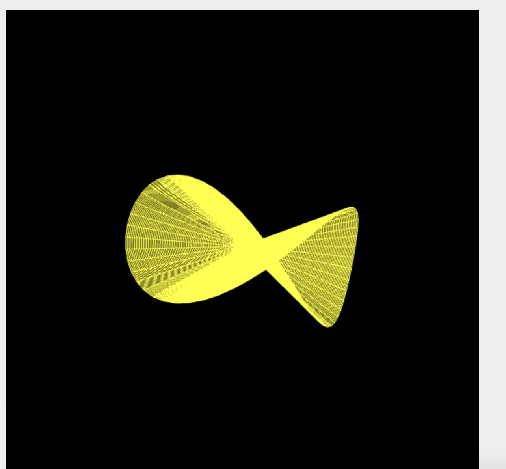
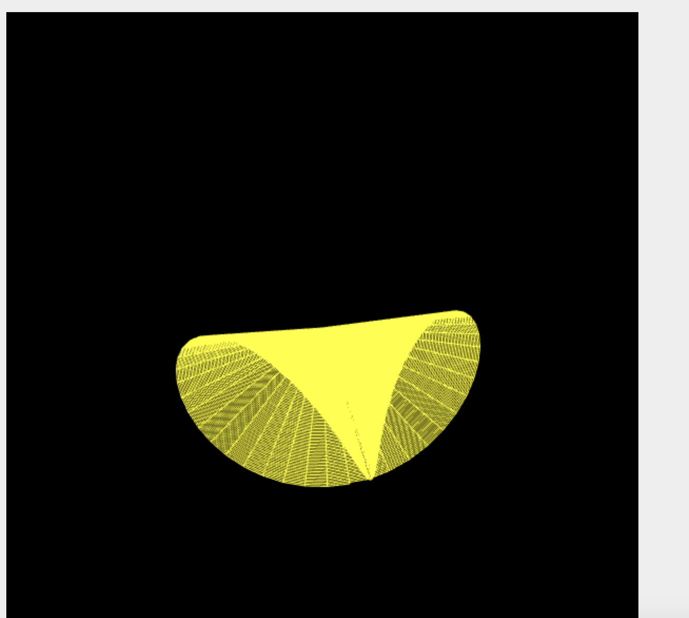

# vggi_labs
VISUALIZATION OF GRAPHICAL AND GEOMETRIC INFORMATION Lab 1

# a = 10, p = 1, pi < u < pi, 0 <= v <= 4

# a = 10, p = 1, pi < u < pi,  0 <= v <= 4

# a = 10, p = 1, pi < u < pi, -a <= v <= 0

# a = 10, p = 1, pi < u < pi,  -a <= v <= 0